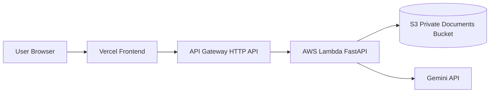
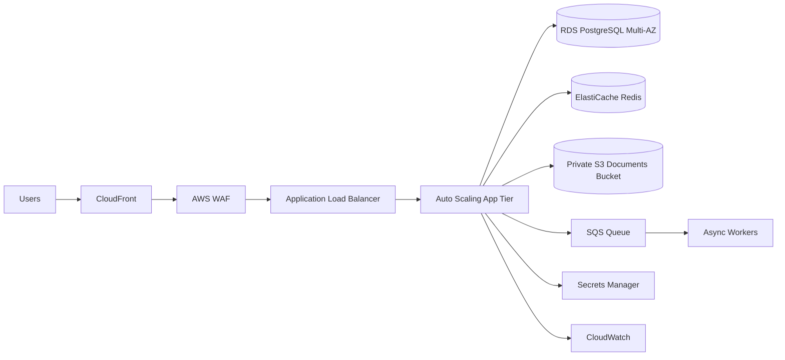

# ClaimPilot Pro

ClaimPilot Pro is an AI-assisted medical coding workflow for clinical-note intake, ICD-10/CPT suggestion, review, and claim PDF generation.

## Live Demo

- Frontend: [claim-pilot-pro.vercel.app](https://claim-pilot-pro.vercel.app)
- Upload page: [claim-pilot-pro.vercel.app/upload](https://claim-pilot-pro.vercel.app/upload)
- Backend API: [API Gateway endpoint](https://qq3ez3zb43.execute-api.us-east-1.amazonaws.com)
- Sample reports: [Google Drive sample reports](https://drive.google.com/drive/folders/1nkFLABt97dOwNJyIqH_32O41ExNiwHD_?usp=sharing)

## Implemented Demo Architecture

This is the low-cost HTTPS architecture currently deployed for demonstration.



Current stack:

- Frontend on Vercel Hobby
- Backend on AWS API Gateway HTTP API
- FastAPI running in AWS Lambda through Mangum
- Private S3 bucket for uploaded documents
- JWT kept application-managed for now
- GitHub Actions backend deploy with Lambda ZIP update

This stack was chosen mainly to reduce infrastructure cost for the demo.

## Large-Scale Production Architecture

For multiple users, stronger security, and horizontal scalability, this is the recommended production architecture.



Recommended production components:

- CloudFront for secure edge delivery
- AWS WAF for request filtering and protection
- ALB for HTTPS load balancing
- app tier on EC2 Auto Scaling Group or ECS/Fargate
- private subnets for application and database tiers
- RDS PostgreSQL Multi-AZ for durable storage
- ElastiCache Redis for cache and session-heavy workloads
- private S3 buckets for document storage
- SQS workers for asynchronous processing
- Secrets Manager for credentials
- CloudWatch for logs, metrics, and alarms

## Upload Flow

The Upload page uses a 4-box layout:

- Top left: `Drop PDF or Image`
- Top right: `Extracted Content Preview`
- Bottom left: `Paste Clinical Notes`
- Bottom right: `Sample Documents`

User flow:

1. Upload a PDF/image or paste clinical note text
2. If pasting text, click `Process Text`
3. Review extracted content in the preview panel
4. Click `Suggest Codes`
5. Review suggested ICD-10/CPT codes
6. Approve and continue claim workflow

## Environment

### Frontend on Vercel

Set these environment variables in Vercel:

```env
VITE_API_URL=https://your-api-id.execute-api.us-east-1.amazonaws.com
VITE_ENABLE_S3_DIRECT_UPLOAD=true
VITE_SAMPLE_REPORTS_URL=https://your-public-drive-link
```

### Backend Terraform

Example `infra/terraform/terraform.tfvars`:

```hcl
project_name            = "your-project-name"
environment             = "demo"
aws_region              = "us-east-1"
lambda_package_path     = "../../dist/backend-lambda.zip"
cors_allowed_origins    = ["https://your-project.vercel.app"]
cors_allow_origin_regex = "https://([a-z0-9-]+\\.)*vercel\\.app$"
gemini_api_key          = "your-gemini-api-key"
documents_bucket_name   = "your-demo-documents-bucket"
lambda_memory_size      = 1024
lambda_timeout          = 30
```

Do not commit real secrets in `terraform.tfvars`.

## Local Development

### Backend

```powershell
python -m venv .venv
.\.venv\Scripts\Activate.ps1
pip install -r backend\requirements.txt
uvicorn backend.app.main:app --host 0.0.0.0 --port 8000 --reload
```

### Frontend

```powershell
cd frontend
npm install
npm run dev
```

## Demo Backend Deployment

Build the Lambda ZIP:

```powershell
pwsh .\scripts\build_lambda_package.ps1
```

Deploy or update AWS infrastructure:

```powershell
cd infra\terraform
terraform init -upgrade
terraform plan
terraform apply
```

Update Lambda code after rebuilding:

```powershell
aws lambda update-function-code --function-name your-lambda-function-name --zip-file fileb://dist/backend-lambda.zip --region us-east-1
```

Test the backend:

```powershell
iwr https://your-api-id.execute-api.us-east-1.amazonaws.com/health -UseBasicParsing
```

## CI/CD

### Current CI/CD

- Frontend deploys from GitHub to Vercel
- Backend deploys from GitHub Actions by building a Lambda ZIP and calling `aws lambda update-function-code`

### Required GitHub Actions Secrets

Add these secrets in GitHub:

- `AWS_REGION` = `us-east-1`
- `AWS_ACCESS_KEY_ID` = your AWS access key
- `AWS_SECRET_ACCESS_KEY` = your AWS secret key
- `LAMBDA_FUNCTION_NAME` = your deployed Lambda function name

## Security Notes

Current demo security posture:

- HTTPS on frontend and backend
- private S3 documents bucket
- least-privilege Lambda IAM role
- API Gateway CORS limited to the Vercel origin

For production, move sensitive configuration such as model keys into a managed secret store and replace self-managed auth with a managed identity solution.

## Repository Structure

- `backend/app/main.py`: FastAPI application
- `backend/app/lambda_handler.py`: Lambda entrypoint via Mangum
- `backend/app/storage.py`: S3 upload flow
- `backend/app/llm_refine.py`: Gemini and fallback suggestion logic
- `backend/app/medical_fallback.py`: deterministic fallback suggestion logic
- `backend/resources/`: ICD/CPT resource files
- `frontend/src/pages/Upload.tsx`: 4-box upload workflow
- `frontend/src/components/SampleNotes.tsx`: sample notes and sample documents panel
- `frontend/vercel.json`: SPA routing for Vercel
- `scripts/build_lambda_package.ps1`: Lambda ZIP packaging script
- `infra/terraform/`: API Gateway + Lambda + S3 infrastructure

## Authors

- Suriya Chellappan
- Sabari Iyyappan

## License

MIT License
