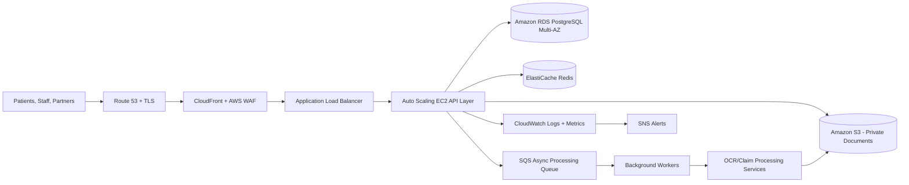

# ClaimPilot Pro AWS Architecture (Business View)

## Value Story

- Scalable under peak claim volume via Auto Scaling.
- Secure document handling with private encrypted S3.
- Highly available app and database across Availability Zones.
- Fast user experience with edge caching and low-latency app tier.
- Operable at enterprise level using centralized monitoring and alerts.
